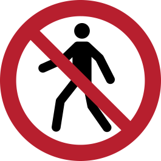

# stopExec
Filter Linux System Calls to Prevent Basic Exploitation

Goals:
- filter execs via list of allowed programs
- filter forks and clones via a separate profiling script
- stop basic exploitation from being generally successful by introducing a hurdle to actually executing anything useful
- keep everything within SystemTap (maybe look at eBPF in the future)
- automatically update profiles (maybe via intermediary C output -> DKMS module, or via staprun (where another machine preps the .ko using the debugsym kernel)
